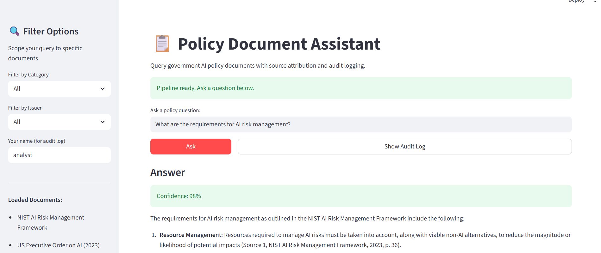
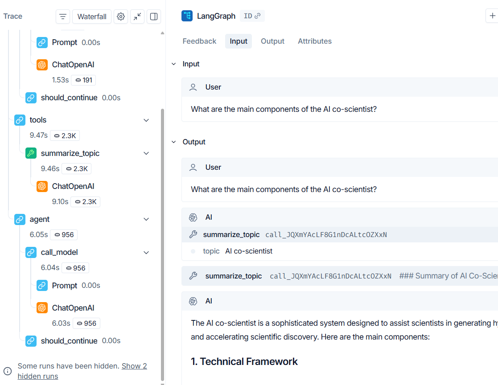

# 📚 Lexis

A production-grade AI document intelligence platform built for enterprise and government use cases. Lexis combines a full RAG pipeline, a conversational research agent, and a policy document assistant. Each built from scratch with real deployment constraints in mind.



---

## Architecture

```
lexis/
├── src/
│   ├── ingestion/        # Document loading + metadata enrichment
│   ├── chunking/         # Recursive text splitting with overlap
│   ├── embeddings/       # OpenAI embeddings with semantic validation
│   ├── vectorstore/      # ChromaDB with idempotent ingestion
│   └── retrieval/        # RAG chain with source attribution
├── policy_assistant/
│   ├── core/
│   │   ├── ingestor.py   # Policy-specific ingestion with document registry
│   │   ├── retriever.py  # Filtered retrieval + confidence scoring
│   │   └── audit.py      # Query audit logging (JSONL)
│   └── app.py            # Streamlit web UI
├── src/agent/
│   ├── agent.py          # LangGraph ReAct agent
│   └── tools.py          # Search, summarize, compare tools
├── app.py                # Conversational CLI chatbot
└── agent_app.py          # Agent CLI interface
```

### RAG Pipeline Flow

```
Raw Documents
     │
     ▼
Ingestion Layer ──► Metadata Enrichment (filename, source_type, page)
     │
     ▼
Chunking Layer ──► RecursiveCharacterTextSplitter (1000 chars, 200 overlap)
     │
     ▼
Embedding Layer ──► OpenAI text-embedding-3-small (1536 dimensions)
     │
     ▼
Vector Store ──► ChromaDB (local persistence, idempotency check)
     │
     ▼
Retrieval + Generation ──► GPT-4o-mini with source attribution prompt
     │
     ▼
Answer + Sources + Confidence Score
```

---

## Projects

### 1. RAG Pipeline (`src/` + `app.py`)

A complete retrieval-augmented generation pipeline built layer by layer. Ingests PDF documents, chunks them with overlap to preserve context across boundaries, embeds with OpenAI's text-embedding-3-small, stores in ChromaDB with idempotent ingestion, and generates answers with strict source attribution.

Includes a conversational CLI chatbot (`app.py`) that maintains the last 5 turns of conversation history, enabling follow-up questions without re-stating context.

Key production decisions:
- Metadata enrichment at ingestion time for downstream filtering
- Idempotency check before every write to prevent duplicate embeddings
- Explicit "I don't know" handling when retrieved context is insufficient
- Conversation history capped at 5 turns to control context window cost

**Run:**
```bash
python app.py
```

---


### 2. ReAct Research Agent (`src/agent/` + `agent_app.py`)

A LangGraph-powered agent that dynamically selects tools based on the user's question rather than following a fixed pipeline. Equipped with three tools:

- `search_documents` — targeted retrieval for specific questions
- `summarize_topic` — deep retrieval across 8 chunks for comprehensive overviews  
- `compare_concepts` — parallel retrieval for side-by-side comparison

The agent decides which tool(s) to use and in what order, observes the result, and decides whether to call another tool or return a final answer. Every run is fully traced in LangSmith — tool selection, token usage, latency, and cost are visible per query.

**Run:**
```bash
python agent_app.py
```

---

### 3. Policy Document Assistant (`policy_assistant/`)

A Streamlit web application for querying government and enterprise policy documents. Built around a document registry pattern — metadata (issuer, category, year, clearance level) is predefined per document rather than extracted, enabling reliable metadata filtering at query time.

**Features:**
- Filter queries by document category (AI Governance, AI Policy, AI Ethics) or issuer (NIST, White House, UNESCO)
- Confidence scoring based on retrieval diversity and chunk quality
- Expandable source citations with document title, issuer, year, and page number
- Full audit logging so that every query logged to JSONL with timestamp, user, filters, sources, and answer
- Separate ChromaDB collection from the research pipeline so there is no data contamination

**Loaded documents:**
- NIST AI Risk Management Framework (2023)
- US Executive Order on Safe, Secure, and Trustworthy AI (2023)
- UNESCO Recommendation on the Ethics of AI (2021)

**Run:**
```bash
streamlit run policy_assistant/app.py
```

---

## Tech Stack

| Component | Technology |
|---|---|
| LLM | OpenAI GPT-4o-mini |
| Embeddings | OpenAI text-embedding-3-small |
| Vector Store | ChromaDB (local) |
| RAG Framework | LangChain, LangChain-Community |
| Agent Framework | LangGraph |
| Observability | LangSmith |
| Web UI | Streamlit |
| Language | Python 3.12 |

---

## Setup

**1. Clone the repo**
```bash
git clone https://github.com/bk-12346/lexis.git
cd lexis
```

**2. Create virtual environment**
```bash
py -3.12 -m venv .venv
.venv\Scripts\Activate.ps1  # Windows
source .venv/bin/activate   # Mac/Linux
```

**3. Install dependencies**
```bash
pip install -r requirements.txt
```

**4. Configure environment variables**

Create a `.env` file in the project root:
```
OPENAI_API_KEY=your_openai_key
LANGSMITH_API_KEY=your_langsmith_key
LANGSMITH_TRACING=true
LANGSMITH_PROJECT=lexis
```

**5. Add documents**

Place PDF files in:
- `data/raw/` — for the RAG pipeline and agent
- `data/policy_docs/` — for the policy assistant (expects the three government documents listed above)

**6. Run**
```bash
# RAG chatbot
python app.py

# Research agent
python agent_app.py

# Policy assistant (browser UI)
streamlit run policy_assistant/app.py
```

---

## Using Your Own Documents

### RAG Pipeline + Agent

Drop any PDF files into `data/raw/` and run the chatbot or agent. They will be automatically ingested on startup.

```bash
# Add your PDFs
cp your_document.pdf data/raw/

# Run — ingestion happens automatically
python app.py
```

The pipeline checks for duplicates before embedding, so restarting won't re-process files you've already ingested. To start fresh with new documents, delete the `chroma_db/` folder:

```bash
# Windows
Remove-Item -Recurse -Force chroma_db

# Mac/Linux
rm -rf chroma_db
```

---

### Policy Assistant

The policy assistant uses a **document registry**. Metadata is predefined per document (title, issuer, category, year) rather than guessed from the file. This enables reliable filtering in the UI.

To add your own policy documents:

**Step 1 — Add your PDF to `data/policy_docs/`:**
```bash
cp your_policy.pdf data/policy_docs/
```

**Step 2 — Register the document in `policy_assistant/core/ingestor.py`:**

Open the file and add an entry to `DOCUMENT_REGISTRY`:
```python
DOCUMENT_REGISTRY = {
    # existing entries...
    "your_policy.pdf": {
        "title": "Your Document Title",
        "category": "AI Governance",   # or "AI Policy", "AI Ethics", or add your own
        "issuer": "Your Organisation",
        "year": 2024,
        "clearance_level": 1
    }
}
```

**Step 3 — Add your category/issuer to the UI filters in `policy_assistant/app.py`:**
```python
category_filter = st.sidebar.selectbox(
    "Filter by Category",
    options=["All", "AI Governance", "AI Policy", "AI Ethics", "Your New Category"]
)

issuer_filter = st.sidebar.selectbox(
    "Filter by Issuer",
    options=["All", "NIST", "White House", "UNESCO", "Your Organisation"]
)
```

**Step 4 — Delete the policy vector store and re-ingest:**
```bash
# Windows
Remove-Item -Recurse -Force policy_chroma_db

# Mac/Linux
rm -rf policy_chroma_db
```

Then run the app — your document will be ingested automatically on startup:
```bash
streamlit run policy_assistant/app.py
```

---

## What This Demonstrates

- End-to-end RAG pipeline built from scratch. This is not a wrapper around a tutorial.
- Production patterns: idempotent ingestion, metadata filtering, audit logging, confidence scoring
- Agent architecture with dynamic tool selection and full observability
- Real government documents as data so it is directly relevant to enterprise/government clients
- LangSmith integration for tracing every LLM call, tool invocation, and token cost
